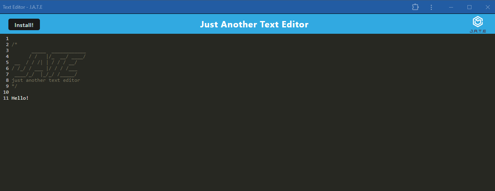

# PWA Text Editor

## Description
This application allows a user to write text, snippets of code, or anything that the user wants to remember. They can also download the application for offline use and it will still store the information offline. I was responsible for the PUT and GET methods, as well as setting up the webpack config and package.json scripts. I also added event listeners, and wrote code for a service worker.

## Usage

Here is the live link to Render: https://pwa-text-editor-b1t4.onrender.com

